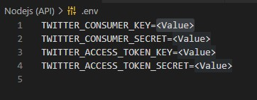

# Nodejs (no printing service)
This is where all the logic will be added

## Before getting in to this project
this project created to be compatible with [Heroku](https://www.heroku.com/)

## Getting start
* *You need to have [Twitter developer](https://developer.twitter.com/en) account*
* *if you want to run it locally you can put your environment varibles in .env file*

* *or if you want to run on server you can add environment varibles in server (recommended) or put them in .env file*

* *Change the hashtag to anything you want !*
### Have fun
:)
